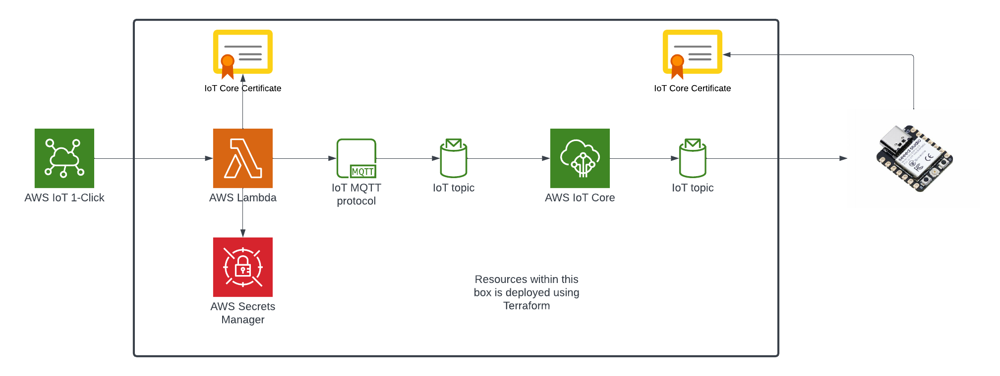

The Terraform code in this repository was ported from the AWS CloudFormation code found here: [template.yaml](https://github.com/chiwaichan/aws-iot-cat-feeder/blob/main/aws/template.yaml). While the CloudFormation template and the accompanying instructions in my previous [blog](https://www.chiwaichan.co.nz/2021/11/04/smart-cat-feeder-part-2/) deploys the identical AWS resources as the code in this repository, the Terraform version deploys resources without any manual steps or changes to the code other than configuring your AWS CLI Profile, whereas the CloudFormation template version requires a series of manual steps to create 2 certificates in the AWS IoT Core Service and passing the details of these certificates into the CloudFormation stack as it created. 

This Terraform code deploys to following architecture:

For a complete overview of what this architecture is used for check out my [blog series](https://www.chiwaichan.co.nz/2021/10/16/smart-cat-feeder-part-1/)

# Prerequisite
 - Terraform installed
 - An AWS Account to deploy these resources into
 - AWS CLI installed and setup as the Terraform AWS Provider is using the Profiles managed by the AWS CLI

# Deployment
 - Clone this repository and cd into it
 - In your command line run "terraform init"
 - Open the "providers.tf" file, then enter the name of the AWS CLI Profile you wish to use to deploy the resources in the AWS Provider declaration.
 - Open the "variables.tf" file, then enter the value of the AWS Region you like to deploy your resources into by changing the Terraform Variable "region"
 - Run "terraform apply"
